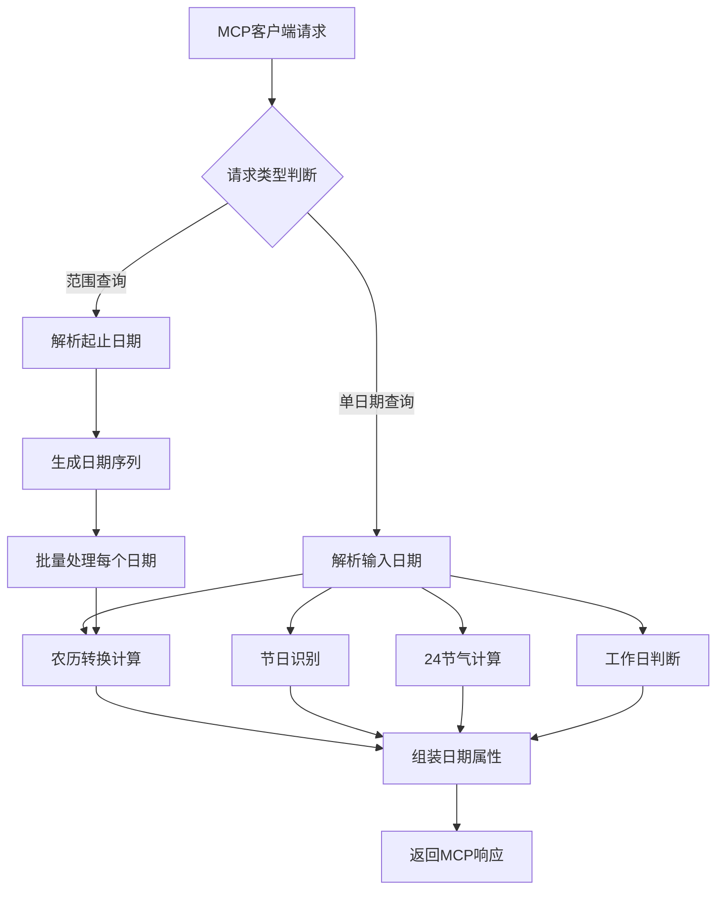

# 中国农历节日转换MCP服务产品需求文档

## 1. Product Overview

本产品是一个基于MCP（Model Context Protocol）协议的Node.js服务，提供公历日期到中国农历、节日、24节气的智能转换功能。服务能够准确识别中国法定节假日调休规律，为用户提供完整的日期属性信息，包括农历日期、节日名称、工作日类型等。

产品主要解决日期转换和节日识别的复杂性问题，适用于需要中国传统历法和现代日历结合的应用场景，如日程管理、节日提醒、文化教育等领域。

## 2. Core Features

### 2.1 User Roles

本产品为API服务，无需用户注册，通过MCP协议直接调用。

### 2.2 Feature Module

本MCP服务包含以下核心功能模块：

1. **单日期查询接口**：输入单个日期，返回该日期的完整属性信息
2. **日期范围查询接口**：输入起止日期范围，返回范围内每一天的日期属性数组

### 2.3 Page Details

| 模块名称 | 功能名称 | 功能描述 |
|---------|---------|---------|
| 单日期查询接口 | 日期属性解析 | 接收公历日期输入，返回包含date、week、dayType、adjusted、festival、solarTerm、lunarDate等完整属性的对象 |
| 单日期查询接口 | 农历转换计算 | 将公历日期转换为带天干地支的农历格式，支持闰月标识 |
| 单日期查询接口 | 节日识别 | 识别中西方节日、公历农历节日，包括春节、中秋节、圣诞节、劳动节等 |
| 单日期查询接口 | 24节气计算 | 计算并识别中国传统24节气，如立春、冬至等 |
| 单日期查询接口 | 工作日判断 | 基于法定调休规律判断工作日/休息日，支持春节、五一、十一三大节点调休识别 |
| 日期范围查询接口 | 批量日期处理 | 处理日期范围输入，批量计算范围内每一天的完整属性 |
| 日期范围查询接口 | 数组结果返回 | 将范围内所有日期的属性信息组织为数组格式返回 |

## 3. Core Process

### 主要操作流程

**单日期查询流程：**
1. 接收MCP协议的日期查询请求
2. 解析输入的公历日期
3. 并行计算农历转换、节日识别、24节气、工作日判断
4. 组装完整的日期属性对象
5. 通过MCP协议返回结果

**日期范围查询流程：**
1. 接收MCP协议的日期范围查询请求
2. 解析起止日期，生成日期序列
3. 对序列中每个日期执行单日期查询逻辑
4. 将所有日期属性组装为数组
5. 通过MCP协议返回结果数组

## 4. User Interface Design

### 4.1 Design Style

本产品为MCP协议服务，无用户界面，通过标准化的JSON格式进行数据交互：

- **数据格式**：标准JSON格式
- **编码方式**：UTF-8编码支持中文
- **响应结构**：统一的成功/错误响应格式
- **日期格式**：中文格式输出（如：2025年9月5日）

### 4.2 API响应格式设计

| 接口类型 | 响应字段 | 数据格式 |
|---------|---------|---------|
| 单日期查询 | date | 中文日期格式：2025年9月5日 |
| 单日期查询 | week | 中文星期：星期五、星期日 |
| 单日期查询 | dayType | 中文类型：工作日、休息日 |
| 单日期查询 | adjusted | 调休标识：调休（可选字段） |
| 单日期查询 | festival | 节日名称：春节、圣诞节等（可选字段） |
| 单日期查询 | solarTerm | 节气名称：立春、冬至等（可选字段） |
| 单日期查询 | lunarDate | 农历格式：壬辰年闰四月初六 |
| 日期范围查询 | 数组 | 包含上述所有字段的对象数组 |

### 4.3 Responsiveness

本产品为后端API服务，通过MCP协议提供跨平台支持，可集成到桌面应用、移动应用或Web应用中。