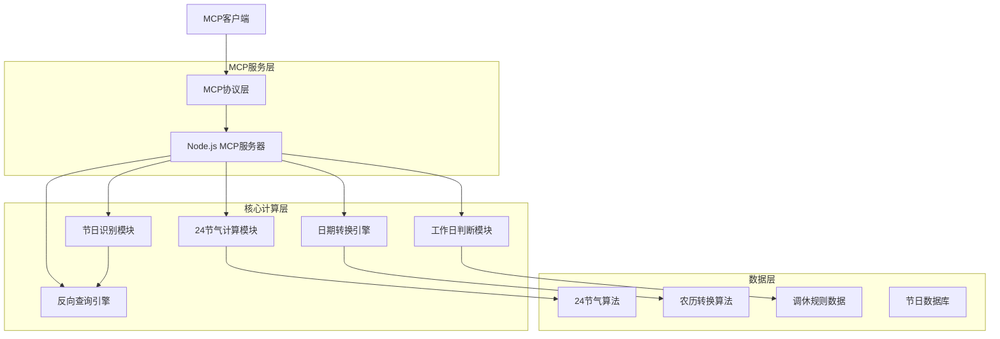
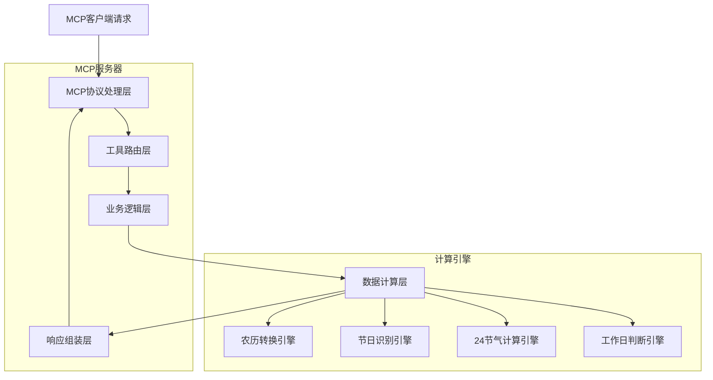
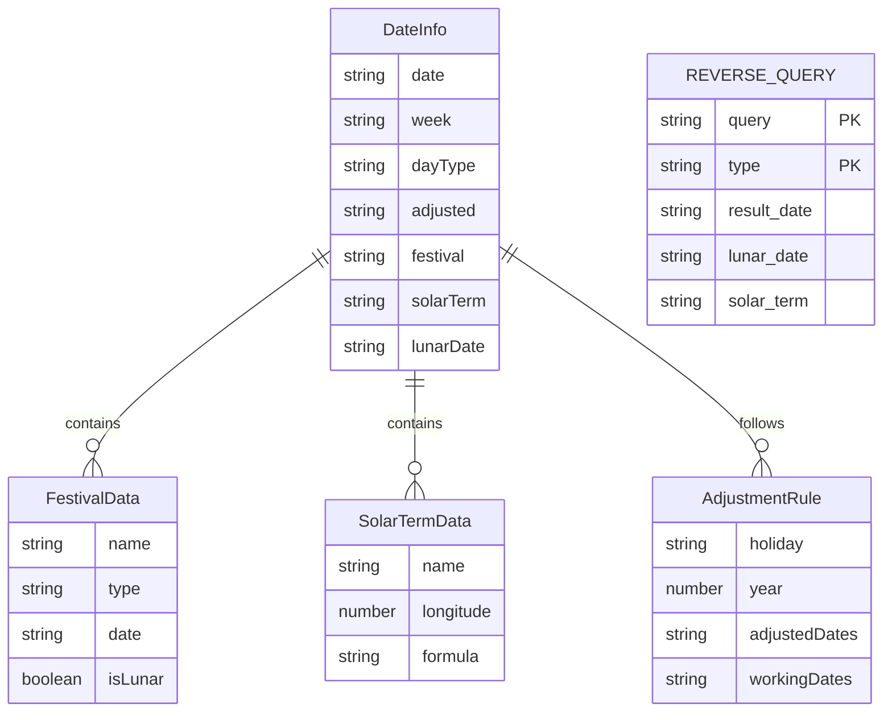

# 中国农历节日转换MCP服务技术架构文档

## 1. Architecture design



## 2. Technology Description

* **后端**: Node.js\@20 + TypeScript\@5 + @modelcontextprotocol/sdk

* **农历计算**: lunar-javascript\@1.6 (农历转换库)

* **日期处理**: date-fns\@3 (日期操作工具)

* **节日数据**: 内置JSON配置文件

* **24节气**: 自实现天文算法

* **调休规则**: 基于法定节假日规律的算法实现

## 3. Route definitions

本服务为MCP协议服务，不使用HTTP路由，而是通过MCP工具定义：

| 工具名称                   | 用途                 |
| ---------------------- | ------------------ |
| get\_date\_info        | 获取单个日期的完整属性信息      |
| get\_date\_range\_info | 获取日期范围内所有日期的属性信息数组 |
| reverse\_query\_by\_name | 通过农历日期、节日名称、节气名称反向查询公历日期 |
| query\_by\_date\_range | 在指定日期范围内查询符合条件的日期（休息日、工作日、节日、节气） |

## 4. API definitions

### 4.1 Core API

#### 单日期查询工具

```typescript
// 工具名称: get_date_info
// 描述: 获取指定日期的完整属性信息
```

请求参数:

| 参数名称 | 参数类型   | 是否必需 | 描述                  |
| ---- | ------ | ---- | ------------------- |
| date | string | true | 输入日期，支持YYYY-MM-DD格式 |

响应数据:

| 字段名称      | 字段类型   | 描述                 |
| --------- | ------ | ------------------ |
| date      | string | 中文日期格式，如：2025年9月5日 |
| week      | string | 中文星期，如：星期五         |
| dayType   | string | 工作日类型：工作日/休息日      |
| adjusted  | string | 调休标识：调休（可选）        |
| festival  | string | 节日名称（可选）           |
| solarTerm | string | 24节气名称（可选）         |
| lunarDate | string | 农历日期，如：壬辰年闰四月初六    |

示例响应:

```json
{
  "date": "2025年1月1日",
  "week": "星期三",
  "dayType": "休息日",
  "festival": "元旦",
  "lunarDate": "甲辰年十二月初二"
}
```

#### 反向查询工具

```typescript
// 工具名称: reverse_query_by_name
// 描述: 通过农历日期、节日名称、节气名称反向查询公历日期
```

请求参数:

| 参数名称 | 参数类型   | 是否必需 | 描述                  |
| ---- | ------ | ---- | ------------------- |
| query | string | true | 查询内容：农历日期、节日名称或节气名称 |
| type | string | true | 查询类型：lunar（农历）\| festival（节日）\| solar_term（节气） |
| year | number | false | 指定查询年份（可选，不指定则查询前后5年） |

响应数据:

| 字段名称  | 字段类型            | 描述                      |
| ----- | --------------- | ----------------------- |
| dates | Array<DateInfo> | 匹配日期的数组，每个元素包含完整的日期信息 |

示例响应:

```json
{
  "dates": [
    {
      "date": "2025年1月29日",
      "week": "星期三",
      "dayType": "休息日",
      "festival": "春节",
      "lunarDate": "乙巳年正月初一"
    },
    {
      "date": "2026年2月17日",
      "week": "星期二",
      "dayType": "休息日",
      "festival": "春节",
      "lunarDate": "丙午年正月初一"
    }
  ]
}
```

#### 条件查询工具

```typescript
// 工具名称: query_by_date_range
// 描述: 在指定日期范围内查询符合条件的日期
```

请求参数:

| 参数名称      | 参数类型   | 是否必需 | 描述                |
| --------- | ------ | ---- | ----------------- |
| startDate | string | true | 起始日期，YYYY-MM-DD格式 |
| endDate   | string | true | 结束日期，YYYY-MM-DD格式 |
| type | string | true | 查询类型：rest_days（休息日）\| work_days（工作日）\| festivals（节日）\| solar_terms（节气） |

响应数据:

| 字段名称  | 字段类型            | 描述                      |
| ----- | --------------- | ----------------------- |
| dates | Array<DateInfo> | 符合条件日期的数组，每个元素包含完整的日期信息 |

示例响应:

```json
{
  "dates": [
    {
      "date": "2025年1月1日",
      "week": "星期三",
      "dayType": "休息日",
      "festival": "元旦",
      "lunarDate": "甲辰年十二月初二"
    },
    {
      "date": "2025年1月29日",
      "week": "星期三",
      "dayType": "休息日",
      "festival": "春节",
      "lunarDate": "乙巳年正月初一"
    }
  ]
}
```

#### 日期范围查询工具

```typescript
// 工具名称: get_date_range_info
// 描述: 获取指定日期范围内所有日期的属性信息
```

请求参数:

| 参数名称      | 参数类型   | 是否必需 | 描述                |
| --------- | ------ | ---- | ----------------- |
| startDate | string | true | 起始日期，YYYY-MM-DD格式 |
| endDate   | string | true | 结束日期，YYYY-MM-DD格式 |

响应数据:

| 字段名称  | 字段类型            | 描述                      |
| ----- | --------------- | ----------------------- |
| dates | Array<DateInfo> | 日期信息数组，每个元素包含上述单日期的所有字段 |

示例响应:

```json
{
  "dates": [
    {
      "date": "2025年1月1日",
      "week": "星期三",
      "dayType": "休息日",
      "festival": "元旦",
      "lunarDate": "甲辰年十二月初二"
    },
    {
      "date": "2025年1月2日",
      "week": "星期四",
      "dayType": "工作日",
      "lunarDate": "甲辰年十二月初三"
    }
  ]
}
```

## 5. Server architecture diagram



## 6. Data model

### 6.1 Data model definition



### 6.2 Data Definition Language

由于本服务使用内存数据和算法计算，不需要传统数据库，以下为核心数据结构定义：

#### 节日数据结构 (festivals.json)

```typescript
interface Festival {
  name: string; // 节日名称
  type: 'solar' | 'lunar' | 'western'; // 节日类型
  date: string; // 日期（MM-DD或农历格式）
  isFixed: boolean; // 是否固定日期
}

// 示例数据
const festivals = [
  { name: '元旦', type: 'solar', date: '01-01', isFixed: true },
  { name: '春节', type: 'lunar', date: '01-01', isFixed: true },
  { name: '劳动节', type: 'solar', date: '05-01', isFixed: true },
  { name: '国庆节', type: 'solar', date: '10-01', isFixed: true },
  { name: '圣诞节', type: 'western', date: '12-25', isFixed: true },
  { name: '中秋节', type: 'lunar', date: '08-15', isFixed: true },
];
```

#### 24节气数据结构 (solarTerms.json)

```typescript
interface SolarTerm {
  name: string; // 节气名称
  longitude: number; // 太阳黄经度数
  order: number; // 节气顺序
}

// 示例数据
const solarTerms = [
  { name: '立春', longitude: 315, order: 1 },
  { name: '雨水', longitude: 330, order: 2 },
  { name: '惊蛰', longitude: 345, order: 3 },
  { name: '春分', longitude: 0, order: 4 },
  // ... 其他20个节气
  { name: '冬至', longitude: 270, order: 22 },
];
```

#### 调休规则数据结构 (adjustmentRules.json) <mcreference link="https://www.gov.cn/zhengce/content/202411/content_6986382.htm" index="2">2</mcreference>

```typescript
interface AdjustmentRule {
  year: number; // 年份
  holiday: string; // 节日名称
  holidayDates: string[]; // 放假日期
  workingDates: string[]; // 调休工作日期
}

// 基于法定调休规律的示例数据
const adjustmentRules = [
  {
    year: 2025,
    holiday: '春节',
    holidayDates: [
      '2025-01-28',
      '2025-01-29',
      '2025-01-30',
      '2025-01-31',
      '2025-02-01',
      '2025-02-02',
      '2025-02-03',
      '2025-02-04',
    ],
    workingDates: ['2025-01-26', '2025-02-08'],
  },
  {
    year: 2025,
    holiday: '劳动节',
    holidayDates: ['2025-05-01', '2025-05-02', '2025-05-03', '2025-05-04', '2025-05-05'],
    workingDates: ['2025-04-27'],
  },
];
```

